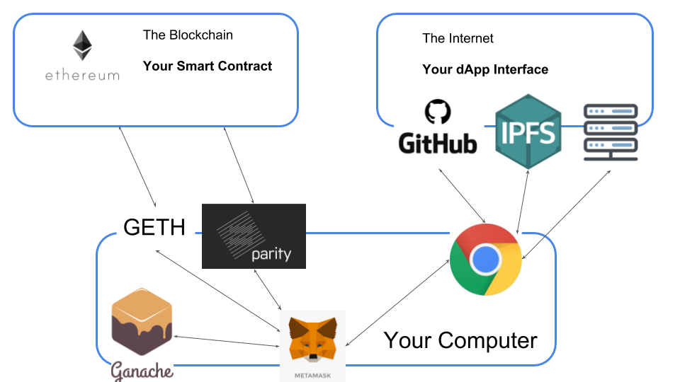

# IntroToDApps

:construction: **Work in Progress** :construction:

First, an ugly diagram:




## Requirements

* [Truffle]
   * [Node] v8.9.4 or later
* [Ganache]
* [Git]
* [Chrome Browser]
* [MetaMask Chrome Extension]
* [Kovan Testnet] Tokens (see detailed instructions below)
* [Infura] account

**Windows Users:** Try using [VS Code with Truffle]

## Prerequisites

* Basic JavaScript skills
* [Truffle Pet Shop] Tutorial - highly recommended


### Testnet Tokens

Ethereum has three main 'test networks' (testnets): Ropsten, Kovan, and Rinkeby.
They are completely separate from each other and from the Ethereum Mainnet. Tokens
on the testnets are worth nothing, they are meant for developing and testing applications.

> > TestNet coins are worthless, but useful. They are useful because they are worthless. If you will add value to them, they will be useless, therefore worthless. 
> > — aphorism from a popular [Bitcoin testnet faucet]

For this workshop we will use Kovan. The easiest way to obtain kovan tokens is to
sign into [Gitter] using a valid GitLab, GitHub, or Twitter account
and then paste your receiving address into the [Kovan Testnet] gitter room.
Testnet tokens will automatically be sent to the address you pasted.

You must get your **Kovan** address from MetaMask. Be sure to select
`Kovan Test Network` from the network drop-down
at the top of the extension. You can click `Account 1` to easily copy the address.

### MetaMask SetUp

To use MetaMask with Ganache, you will need to setup a 'Custom RPC' network connection.
Follow these directions carefully:

1. Start Ganache, don't change any configurations.
2. In the Metamask extension, open the network drop-down menu (it should say `Main Ethereum Network` the first time you use Metamask).
3. Select `Custom RPC`
4. You should be on a `settings` tab, scroll down to `New Network`.
5. In the `New RPC URL` field enter `http://127.0.0.1:7545`
6. Click `Show Advanced Options`.
7. In the `ChainID` field, enter `5777`.
8. Click the `Save` button.
9. Click the `X` in upper right of the extension window if the settings don't go away.
10. You should see a balance of 100 ETH.

**Debug Tip** Resetting Ganache will confuse your MetaMask extension (blockchains
aren't supposed to change). When you reset Ganache, you also need to reset MetaMask.
There is a `Reset Account` button located under `Settings` for this purpose. `Settings`
can be found in the menu shown by clicking the colorful circle in the upper right of the MetaMask.

### Clone this repository

```
git clone https://github.com/destrys/IntroToDApps.git
cd IntroToDApps
```

### Install Dependencies

Navigate to the pet-shop-tutorial directory and install the dependencies:

```
cd pet-shop-tutorial
npm install
```

# Exercise - Interact with an example dApp

Assuming installation and config is correct (see above), running the
pet shop example dApp should be as easy as following these steps:

1. Start Ganache
2. Select the Custom RPC interface and 'Reset Account' in MetaMask
3. From within the `pet-shop-tutorial` directory: `truffle migrate --reset`
4. From within the `pet-shop-tutorial` directory: `npm run dev`
5. Direct your browser to `localhost:3000`

When you click 'adopt', MetaMask should pop up an authorization window.
Authorizing the transaction should change the button from 'Adopt' to 'Success'.

The important files for this dApp are:
(pet-shop-tutorial/contracts/Adoption.sol)[pet-shop-tutorial/contracts/Adoption.sol],
(pet-shop-tutorial/src/index.html)[pet-shop-tutorial/src/index.html],
and (pet-shop-tutorial/src/js/app.js)[pet-shop-tutorial/src/js/app.js].
Open them in you text editor and poke around.


# Smart Contracts

All paths and commands assume you are in the `pet-shop-tutorial` directory.

Open `contracts/Adoption.sol` in your text editor.

We'll discuss the function and design of this 'smart' contract for a bit.

Some important points to cover:

1. What is stored in the contract?
  a. State
  b. Logic
  c. Views (in this case)
2. How is the contract initialized?
3. How is the state changed, and who has access?
4. What cannot be changed?
5. What off-chain information is part of the app and how are those data joined?

Note: Docs regarding the [array getter function].


## Tests

Open `test/TestAdoption.sol` and `test/TestAdoption.js`

We'll discuss testing. Some important points to cover:

1. Solidity vs. Javascript testing
2. The importance of testing


# Exercise - Smart Contract Improvements

## Disallow re-adoption of same pet.

As-is, another address could `adopt()` a pet that has already been adopted,
overwriting the first adopter's address. The UI doesn't allow this by
disabling the button, but it wouldn't be hard for someone to change the UI...
You can see this by commenting out the following line in `src/js/app.js`
(it's part of the `markAdopted` function).

```
$('.panel-pet').eq(i).find('button').text('Success').attr('disabled', true);
```

Implementing this restriction only requires a single line of code, but
think it through carefully. I've included a test file that you can use.
Copy the `TestReAdopt.js` from `solutions/` to `test/`.
Running `truffle test` will now test the an adopted pet can't be re-adopted.

The solution is provided in `solutions/Adoption_stop_readopt.sol`.

**Note:** The tests for this exercise include tests the the contract `reverts`.
This is an important result to test for (and should have been included in the initial
tests)


## Admin address

Now that our contract only allows a pet to be adopted once, it really can only
handle 16 adoptions and then it's done. It would be nice if someone could reset
a pet to unadopted, but we don't want anyone on the internet to be able to do that.

So now we need a privaledged user.

The easiest way to set an admin user is to initialize the admin user as the
address that deployed the contract. Our contract currently doesn't run any function
as it's initialized. You'll need to create the `constructor` function which is
a special function that is only called once, when the contract is created.
([Constructor Function Docs])

Tests are provided in `solutions/TestAdmin.js`, copy to `test/` to use.

The solution is provided in `solutions/Adoption_admin.sol`.

## Admin Reset Function


Now that we have an admin address, let's create a function only the admin can use.
It's basically the reverse of the the `adopt()` function, so let's call it
`unadopt()`. It still needs to check that the index is valid, but it
also needs to check if the address executing the function is the admin.
The address executing the transaction is available at `msg.sender`.
Give it a shot.

Tests are provided in `solutions/TestUnadopt.js`, copy to `test/` to use.

The solution is provided in `solutions/Adoption_unadopt.sol`.

There are additional checks and functions you could add around this feature:

1. Don't allow `unadopt` to be called if the pet hasn't been adopted.
2. Allow the admin *or the address that adopted* to unadopt
3. Create an `unadoptAll` function so an admin could clear all the pets in one transaction.


## Some Additional Ideas:

1. Add a price to adopting. (look up `payable` in the solidity docs)
2. Create a whitelist of addresses that are allowed to adopt.
3. Add a pet identifier to the state


## Addition Smart Contract Resources

1. [Remix] - alternative/complementary IDE
2. [The Ethernaut] - learn smart contract security issues via blockchain-based 'game'


# DApps, UIs, Etc.

The term DApp ('decentralized app' or 'distributed app') is used as a catch-all
for a lot of things. It is usually used to talk about a website that connects to
a blockchain. Hopefully as the industry matures, the definition will harden.
For this class, DApp refers to the entire system, both smart contract and interface.

So let's look at the included interface for this tutorial.

**Note:** If you haven't finished the exercies above,
copy `solutions/Adoption_unadopt.sol` to `contracts/Adoption.sol`. If you
want to re-work through the exercises, the original `Adoption.sol` is
included at `solutions/Adoption_original.sol`.

Points to cover:

1. Glance at the html
2. [web3 package] - where does it come from, what does it do? (window.ethereum)
3. What data are available on load?
4. How to request data.
5. How to form and execute transactions.

**Note:** This app included `web3` and `truffle-contract` files. For your project,
you may want to use the npm to include the [web3] and [truffle-contract]

**Caution!** The `web3` included in this app is an older version. `web3` v1.0
is still in beta and
has many breaking changes, so for this class, refer to the [old web3 docs]. 


## Exercise - Admin Viewing Button

Let's edit the app to notify the viewer if they are the admin.

Copy `solutions/index_admin_badge.html` to replace `src/index.html`.

In `src/js/app.js` take a shot at writing a `setAdmin` function that
checks if the logged-in [account] matches the admin account of the contract.
If it doesn't match, [hide] the admin badge.

And be sure to run `setAdmin()` in `initContract`.

A solution is provided in `solutions/app_admin_badge.js`.

## Exercise - UnAdopt Button

Let's continue by providing the admin an interface to the `unadopt` contract
function.

Copy `solutions/index_unadopt.html` to `src/index.html` (or write your own button
code).

As part of `setAdmin`, also hide the `unadopt` buttons from non-admins.

Write a `handleUnadopt` function to call `unadopt` on the contract
when the Unadopt button is clicked. And don't forget to add the handler to
`bindEvents`.

**Important Note:** While we are hiding the admin interface from non-admins, there
is nothing to stop and address from *attempting* to call `unadopt` on our contract.
What is powerful about dApps is that the authorization is handled by ethereum.
If the transaction isn't signed by the admin's address, the contract will call
`revert` and the transaction will be unsuccessful. We don't have to worry
about users or passwords.

## Additional Ideas

1. Admin `resetAll` function
  a. contract function that resets all adopters
  b. Admin-only button
2. Encode the Pet Name in the Smart Contract
  a. Add another array in the smart contract for pet name
  b. Choose how to initialize (and edit) the names in the contract
  c. Decide how to pull names from contract, and add that to the UI.
3. Allow the adopter to also see the Unadopt button.
  a. Edit the smart contract to allow the admin *or* the adopter call `unadopt`.
  b. Edit the javascript to show the Unadopt button for the adopter as well.


# Deployment


**WIP**


[infura reference]: https://medium.com/coinmonks/steps-to-deploy-a-contract-using-metamask-and-truffle-7ae65e6d8dc8


[truffle]: https://truffleframework.com/docs/truffle/getting-started/installation
[node]: https://nodejs.org/en/
[ganache]: https://truffleframework.com/ganache
[git]: https://git-scm.com/
[chrome browser]: https://www.google.com/chrome/
[metamask chrome extension]: https://metamask.io/
[kovan testnet]: https://gitter.im/kovan-testnet/faucet
[infura]: https://infura.io

[truffle pet shop]: https://truffleframework.com/tutorials/pet-shop

[bitcoin testnet faucet]: http://tpfaucet.appspot.com/
[gitter]: https://gitter.im
[array getter function]: https://solidity.readthedocs.io/en/latest/types.html#arrays
[constructor function docs]: https://solidity.readthedocs.io/en/v0.5.6/contracts.html#creating-contracts
[remix]: https://remix.ethereum.org
[the ethernaut]: https://ethernaut.zeppelin.solutions/
[vs code with truffle]: https://medium.com/edgefund/ethereum-development-on-windows-part-1-da260f6a6c06
[web3 package]: https://web3js.readthedocs.io/en/1.0/
[web3]: https://www.npmjs.com/package/web3
[truffle-contract]: https://www.npmjs.com/package/truffle-contract
[old web3 docs]: https://github.com/ethereum/wiki/wiki/JavaScript-API
[account]: https://github.com/ethereum/wiki/wiki/JavaScript-API#web3ethaccounts
[hide]: http://api.jquery.com/hide/